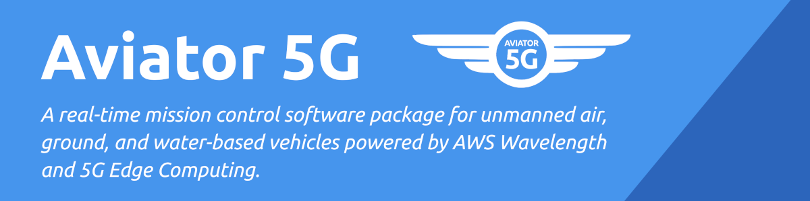
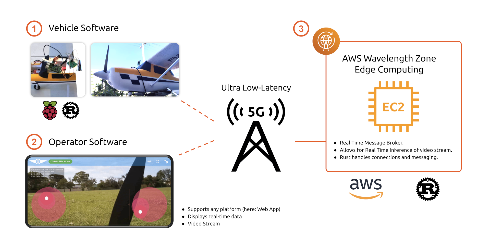
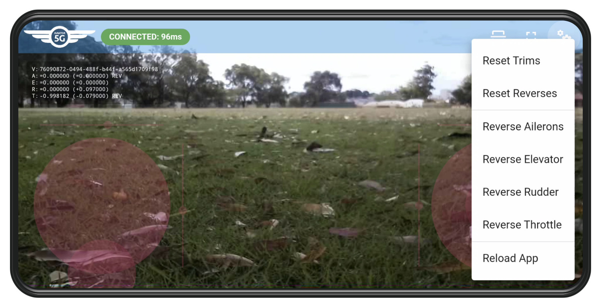
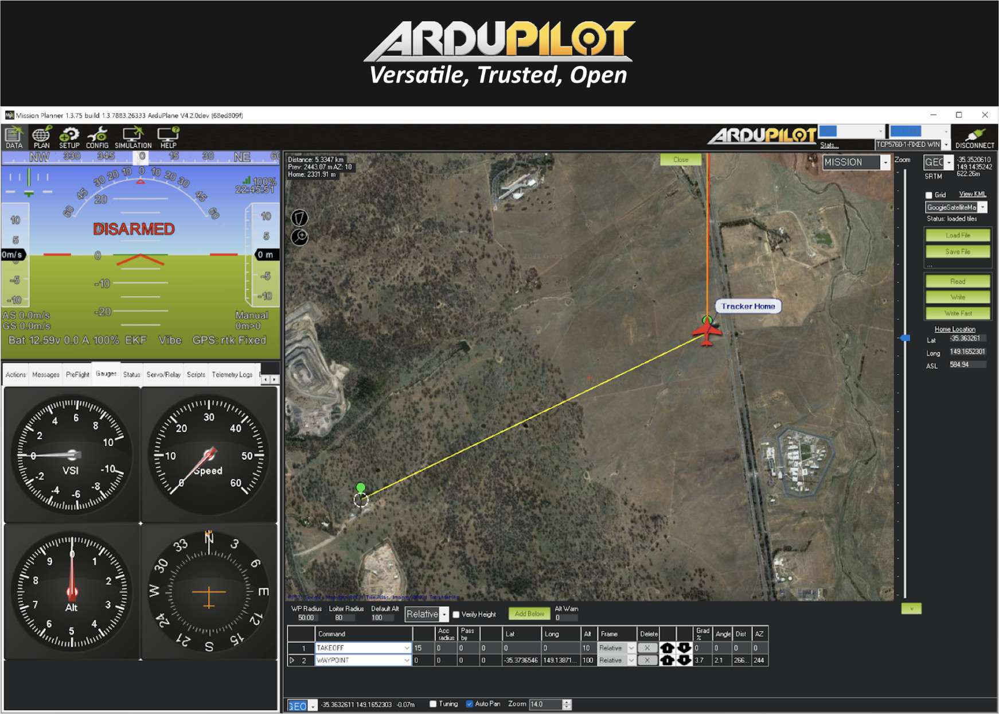

[](https://aviator5g.silentbyte.com)&nbsp;
[](https://aviator5g.silentbyte.com)&nbsp;
[](https://aviator5g.silentbyte.com)


# Aviator 5G

Aviator 5G is an experimental, real-time mission control software package for unmanned air, ground, and water-based vehicles powered by AWS Wavelength and 5G Edge Computing. This repository represents our submission for the [5G Edge Computing Challenge with AWS](https://aws5gedge.devpost.com/).


## Inspiration

The drone and remotely-controlled vehicle industry is growing at an increasingly rapid pace and drones find a large variety of applications, including Emergency Response & Disaster Relief, Land Surveying & Agriculture, Transport & Delivery, and many more. Used by both professionals and hobbyists, drones are definitely here to stay.

However, there are some things that need to be addressed. Not every drone can or is most-optimally controlled fully autonomously. Most missions can greatly benefit from human interaction and sometimes human intervention is a necessity, for example when the drone cannot follow the regular mission plan anymore due to unforeseen situational changes. Rovers can get physically stuck while navigating difficult terrain, drones may lose the radio signal or their GPS fix, or may simply not be able to reach a pre-defined waypoint due to strong winds.

Think of a Search & Rescue mission. A person has been reported missing and emergency services in the area launch a drone. Mission control is **entirely** cloud-based, so there is **no** setup required and precious time is saved. Imagery and other sensor data from the drone can be **analyzed in real-time** using machine learning and operators are notified immediately and can effectively alter the mission plan and potentially save lives in a situation like this.

*"Essentially, Aviator 5G aims to streamline human intervention. Through ever-improving wide-area 5G coverage, **AWS Wavelength is ideal for this use case**."*


## What it does

Our solution comes in three parts (see architectural overview below):

- One, the drone control software running on a Raspberry PI that controls the aircraft.

- Two, a purpose-built interface for the operator.

- Three, an EC2 instance running in a Wavelength zone that connects the two.

This setup makes it possible to remotely control a vehicle wherever there is 5G connectivity and the mission operator is not limited by short-range radio transmitters.



For the communication between the three different components, we devised a simple, easily extendable, bi-directional messaging protocol that is vehicle-agnostic and thus adaptable to any situation.

The protocol...

* ...supports control groups that allow grouping of multiple operators and vehicles so that they can simultaneously exchange information with the group.

* ...is useful for drones, rovers, boats, etc.

* ...supports an number of axes, buttons, and other inputs and values such as GPS coordinates, altitude, compass direction, acceleration, etc.

* ...allows for real-time piloting which is only made possible due to AWS Wavelength's low latency connections.

* ...can trivially be adjusted to meet other specific mission requirements.

Additionally, we have WIP support for video streaming which is the foundation for the aforementioned real-time machine learning inference.


## How we built it

For our demo, we have built a messaging server, a vehicle control software running on a Raspberry PI, and a web-based operator software. However, due to the high flexibility of the system, it can easily be adapted for different platforms and technologies.


### Messaging Server (Broker)

The messaging server is designed to run inside of an AWS Wavelength Zone on an EC2 instance (or EC2 G4 when using ML-features). Incoming connections are handled by a Websocket server written in Rust that forwards messages to their correct destination(s). The server also handles the WIP video streams received from the vehicles and exposes them to the operators.


### Vehicle Control Software

The control software for the vehicles is also written in Rust and -- in our case for the demo -- runs on a Raspberry PI 3B. We have implemented four channels to control ailerons, elevator, rudder, and throttle. To control the servos and the electric motor, we are using pulse-width modulation (PWM). Ailerons and elevator use the Raspberry PI's two available hardware PWM pins whereas rudder and throttle are implemented in software.

On startup, the control software initializes the drone, connects to the server's open socket, and identifies itself and its group. Finally, the attached Raspberry PI Camera is initialized and a video stream is sent to the server.


### Operator Software

For the purpose of this demonstration, we have created a web-based software for the operator to control the vehicle (using TypeScript and Vue). To really test our system -- especially in terms of latency -- we have decided to give the operator **direct** control of the aircraft instead of just issuing commands to alter the flight path (as it is the case with most drones).

In order to achieve this, the app features two touch-based virtual joysticks, giving the operator control over the aircraft's four channels: ailerons, elevator, rudder, and throttle. Rudder and throttle are controlled with the left stick, ailerons and elevator are controlled with the right stick.


Additionally, the app allows the operator to switch to full-screen, flip the video stream to correct the orientation if necessary, to trim the aircraft on all four channels and to individually activate control reversal. As seen in the image below, we have reversed the ailerons and throttle axes for this test.




The following animation shows the aircraft reacting to control inputs in real-time. Keep in mind that this is not a direct connection between the phone and the plane. Instead, the connection goes through the EC2 instance running in the cloud.


While the end product for this demo is a web-based operator interface, we would like to reiterate that any interface can be implemented and connected to our system. For example, during early prototyping and development, we used a Python-based client and a physical flight stick for control.


## Challenges we ran into


### Video Encoding

As we examined a few different approaches to streaming video, including RTSP, we discovered that available implementations were buffering frames to reduce lag/stutter. Unfortunately, this generally resulted in a delay of about two seconds (depending on buffer size), which is too long for our use case. We eventually decided to switch to a plain MJPG-stream with variable compression and were able to achieve great results. However, this is definitely an area that warrants further investigation and offers great potential for optimization.


### Testing

One of the main challenges we ran into was testing the system. AWS Wavelength is currently only available in select cities around the world. As we are based in Perth, Australia, we do not have direct access to AWS Wavelength at this stage.

For general testing during development, we mainly resorted to using a Local Area Network environment and deployed onto a test system running on a standard AWS EC2 instance in the Asia Pacific region. This turned out to be a good compromise because once the system is running properly in a regular AWS region, it can easily be deployed into an AWS Wavelength zone.


## Accomplishments that we're proud of

We are excited that we managed to achieve our goals during this hackathon and that we were able to create a working prototype of an aircraft entirely controlled through the cloud in real-time with low latency, despite not having direct access to AWS Wavelength at this stage.


## What we learned

During the course of this project, we had the chance to try out various things that were new to us:

1) We had a chance to take a closer look at AWS Wavelength / 5G technology and make things possible using this promising technology.

2) We were able to learn a lot more about IoT, hardware, electric circuits, and flight controllers. We previously had very limited experience with IoT and it was amazing to see all the parts of the entire system working well together.


## What's next for Aviator 5G

We are aiming to further improve the system and go through additional development iterations:

* We would like to focus on video compression and streaming, as this is the part of the system that benefits the most from improvements and optimizations.

* We plan to improve the configurability so that the vehicle control software can be configured externally (e.g. what axis input corresponds to what function of the drone).

* We would like to integrate the system with [ArduPilot](https://ardupilot.org) so that it can be used to enhance a largely-autonomous mission with direct human control over a wide-area network.



## Development & Building

To build and run this project, you need to install Rust and NodeJS. The easiest way to install Rust is by using the [RustUp Installer](https://rustup.rs). NodeJS is available [here](https://nodejs.org/en/). You will also need to install [Yarn](https://yarnpkg.com).


### Messaging Server & Vehicle Control Software

The root of this repository is a Rust/Cargo project. To build the Messaging Server and the Vehicle Control Software, simply run `cargo build --release`. This will download all required dependencies automatically and build both projects.

Once built, the server can be started locally on port 9000 by running `cargo run --release --bin aviator5g-server -- --host 0.0.0.0 --port 9000`.

It supports the following options:

```
Usage: aviator5g-server [--host <host>] [--port <port>]

Aviator5G Server.

Options:
  --host            the hostname on which the server listens.
  --port            the server's port.
  --help            display usage information
```

The vehicle control software can be started by running `cargo run --bin aviator5g-vehicle -- --url ws://localhost:9000`. It will connect to the local server we have just started before.

It supports the following options:

```
Usage: aviator5g-vehicle --url <url>

Aviator5G Vehicle.

Options:
  --url             the server's endpoint to which this vehicle should attempt
                    to connect.
  --help            display usage information
```

*Note that the vehicle control software should be run on a Raspberry PI as otherwise it will not be able to start up as it cannot connect to the servos.*


### Operator Software

The operator software is web-based. It is built using Vue and is available in the `aviator5g-pilot` folder. To build the project, navigate into the folder and run `yarn install` followed by `yarn build`. If you want to execute the app locally, run `yarn serve` instead. The app is then available locally under `http://127.0.0.1:8080`.
